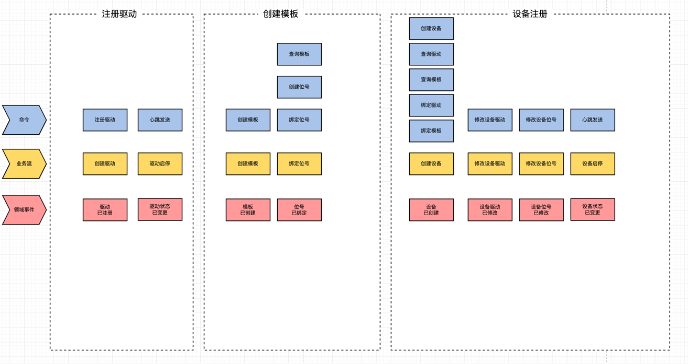
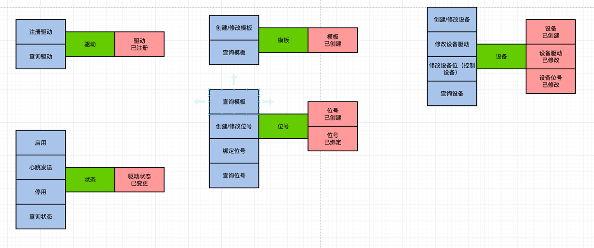

# 一、应用架构


# 二、模块说明
```lua
vms
├── vms-api                          -- 接口层
     ├── vms-api-iot                 -- iot
     ├── vms-api-system              -- 通用用户权限 
├── vms-application                  -- 应用层 
     ├── vms-application-iot         -- iot应用层 
├── vms-domain                       -- 领域模型
     ├── vms-domain-iot              -- iot领域模型
├── vms-infrastructure               -- 基础层
     ├── vms-auth                    -- 认证 
     ├── vms-config                  -- 配置
     ├── vms-core                    -- 集合
     ├── vms-gateway                 -- API网关
     ├── vms-rpc                     -- rpc
     └── vms-upms                    -- 通用用户权限
├── vms-modules 业务模块      
     ├──vms-service-alarm            -- 报警管理服务模块
     ├──vms-service-device           -- 设备管理服务模块
     ├──vms-service-file             -- 文件管理服务模块
     ├──vms-service-job              -- 任务管理服务模块
     ├──vms-service-monitor          -- 监控管理服务模块

```
### 1. IOT模块
+ 项目基本信息：IOT（驱动/设备/数据）
  - 驱动注册/健康
  - 设备注册/健康/移除 
  - 数据接收/发送
    <br><br>
+ 战略设计<br>
  　　战略设计是根据用户旅程分析，找出领域对象和聚合根，对实体和值对象进行聚类组成聚合，划分限界上下文，建立领域模型的过程。<br>
  　　战略设计采用的方法是事件风暴，包括：产品愿景、场景分析、领域建模和微服务拆分等几个主要过程。<br>
  　　战略设计阶段建议参与人员：领域专家、业务需求方、产品经理、架构师、项目经理、开发经理和测试经理。
  - 产品愿景：分布式物联网(IOT)平台 
  - 场景分析
    - 驱动<br>
      - 用户：系统 <br>
      `* `自动注册至IOT平台<br>
    - 设备<br>
      - 用户：用户 <br>
      `* `登录系统：从权限微服务获取创建人信息和权限数据，完成登录认证<br>
      `* `创建模板：打开创建模板页面，填写模板基本信息，保存<br>
      `* `创建位号：打开模板详情页面，新增/修改位号信息，保存<br>
      `* `创建设备：打开创建设备模板页面，填写设备基本信息，绑定驱动，绑定模板，设备驱动编辑，设备位号编辑<br>
        <br>
    - 数据<br>
  - 领域建模<br>
    - 领域对象
      - 驱动/模板/数据
    
    - 聚合
      - 驱动
      - 设备：模板、位号、设备
      - 状态
      - 数据
    <br><br>
+ 战术设计<br>
  　　在完成领域模型和微服务设计后，我们还需要对微服务进行详细的设计。主要设计以下内容：实体属性、数据库表和字段、实体与数据库表映射、服务参数规约及功能实现等。 <br>
  <br><br>
+ 详细设计<br>


# 核心依赖


依赖 | 版本| 功能|
---|---|---
Spring Boot |  2.4.1  |Spring Boot
Spring Cloud Alibaba | 2021.1  | Spring Cloud Alibaba
Spring Cloud | 2020.0.4|Spring Cloud
Hutool | 5.0.7 | 通用工具类
Mybatis-Plus | 3.3.0 | MyBatis增强
    
# 编码规范

##参照Alibaba Java规范手册


#注意事项

#版本功能
